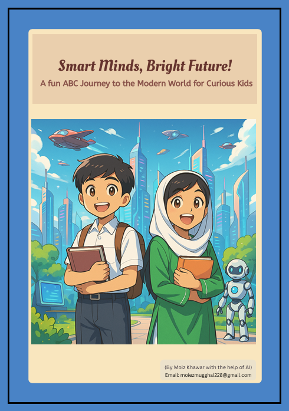

# 🌟 Project 2: ABCs of the Modern World 🌍

## ✨ Overview
📚 This project is an **educational ebook** crafted for kids aged **8-12**, introducing them to **modern technology** and concepts through the **26 alphabets**! 🎉 The goal is to **inspire young minds**, familiarize them with **contemporary tech terms**, and make learning **fun and engaging**. 🌈 The ebook also features **short stories** with a unique **Pakistani cultural touch** to make it relatable and exciting! 🇵🇰

## 🚀 Features
- 🔤 **Alphabet-Based Learning**: Each letter unveils a fascinating modern concept or technology. 💡
- 🤖 **AI-Generated Content**: Leveraged AI to create **engaging** and **age-appropriate** material. 🧠
- 🕌 **Cultural Integration**: Infused a **Pakistani perspective** to connect with local readers. 🌟
- 🎨 **Interactive Design**: Designed **visually stunning pages** using Canva. 🖌️
- 📖 **Short Stories**: Added **captivating tales** to keep children hooked. ✍️

## 🛠️ Technologies Used
- 🤖 **AI** for content generation
- 🎨 **Canva** for design and layout
- 📄 **PDF tools** for ebook compilation

## 🌟 Challenges Faced
- 🧩 Striking a balance between being **educational** and **entertaining** for kids. 🎯
- 🌍 Merging **modern tech concepts** with **cultural relevance**. 🌐
- 📐 Crafting **visually appealing designs** while ensuring readability. 👓

## 🏆 Outcomes
- ✅ Created an **engaging and educational ebook** for children. 🎉
- 💬 Received **positive feedback** from parents and educators for its **innovative approach**. 🌟
- 🌈 Helped kids learn **modern concepts** in a **fun and interactive way**. 🚀

## 🌱 Future Improvements
- 🧩 Add **interactive quizzes** or activities for enhanced engagement. 🎮
- 🌍 Translate the ebook into **multiple languages** for broader accessibility. 🌐
- 📱 Develop a **companion app** to boost interactivity. 📲

## 📕 Book Cover

